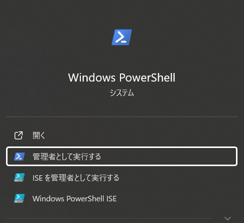
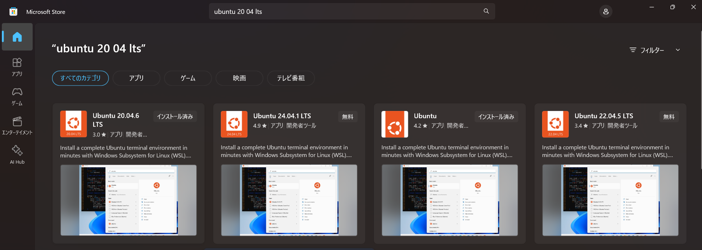
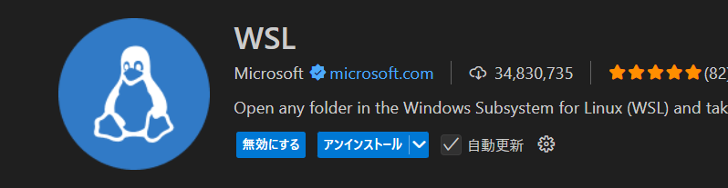
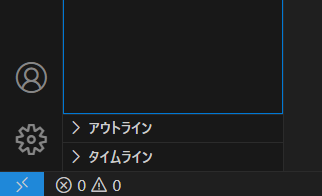
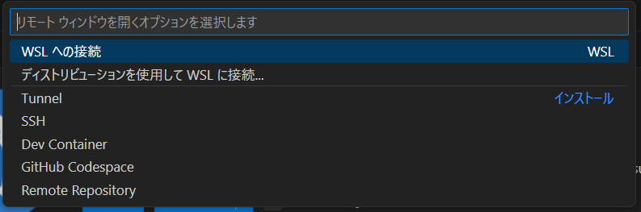

# wsl環境構築
本リポジトリではwslの導入方法についての説明をしている。
windowsでclaude codeなどを使用できるようにしたい人などは参考にしてください。
Qiita記事も考えましたが、慣れているGitHubに記載することにしました。
## wslの設定

wslのインストールが済んでいない場合は

```jsx
wsl --install
```

このコマンドにより、WSL を実行し、Linux の Ubuntu ディストリビューションをインストールするために必要な機能が有効になる

まずはwindows PowerShellを管理者権限で実行する




下記のコマンドにてLinux用 windows サブシステムを有効にする

```jsx
dism.exe /online /enable-feature /featurename:Microsoft-Windows-Subsystem-Linux /all /norestart
```

操作が正常に完了したら仮想マシンの機能を有効化する

```jsx
dism.exe /online /enable-feature /featurename:VirtualMachinePlatform /all /norestart
```

Hyper-Vが有効になっているか確認するため、下記を手順通りに確認

- Windowsキー + Rを押して「実行」を開き、「optionalfeatures.exe」と入力
- 「Windows機能の有効化または無効化」ウィンドウで、以下の項目にチェックが入っているか確認：
    - Hyper-V
    - Windows Subsystem for Linux
    - 仮想マシンプラットフォーム

## ubuntuのインストール

microsoft storeからubuntuのインストールを行う


特にこだわりがなければ20.04でよいが、LTSのものをダウンロードする

インストールが完了したらubuntuを起動する

<!--  -->

初回の起動の際にubuntuを使用するユーザー名とパスワードが求められるので、各自で設定を行う

ここまでが実行できれば問題なくwslの使用が可能になっている

もし、ここで上手くいっていない場合は

WSLを再インストールするとして、PowerShellを管理者として開き、以下のコマンドを実行

```jsx
wsl --unregister Ubuntu
wsl --install -d Ubuntu
```

## vscodeでの設定

上記の手順でwslの使用ができるようになったので、vscodeにてwslに接続できるようにする

vscodeの拡張機能である「wsl」をインストールする


インストールが終わり次第、一度再起動をしておく

再起動後、左下にある青色のところをクリックする



クリック後、wslの接続とあるのでそこをクリック


wslに接続後、ターミナル上でworkspaceを作成し、移動し、ファイルを開く

```jsx
mkdie atcoder
cd atcoder
code .
```

workspaceに移動後、コンパイラの導入のために下記のコードを順に実行していく

y/nを聞かれた場合、yで続行することが可能なので、yと打ちenter

```jsx
sudo apt update
sudo apt upgrade
sudo apt install build-essential
```

念のため下記のコードでバージョンを確認しておく

```jsx
gcc --version
```

あとはcであれば.c、c++であれば.cppファイルを保存し、コンパイルを行う

```jsx
gcc ファイル名.c
g++ ファイル名.cpp
```

コンパイル後、プログラムファイルと同じ階層にa.outが保存されるので、実行していく

```jsx
./a.out
```
